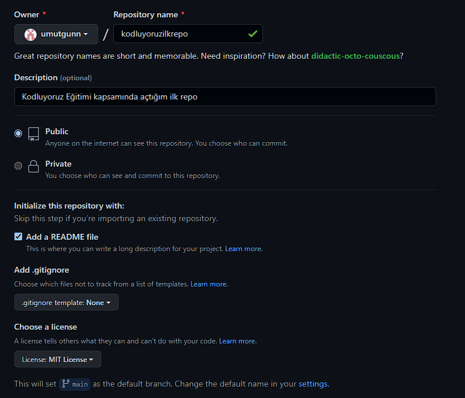

# Kodluyoruz İlk Repo
Bu repo [Kodluyoruz](https://kodluyoruz.org/?gclid=CjwKCAjw4JWZBhApEiwAtJUN0OUMq5QlkCcLtqtuA7xZ7fTCrTNxRGGKrNdgIwE5YxEmqDYRYavFZxoCS9YQAvD_BwE) Java Eğitiminde oluşturduğumuz ilk repo. İçerisinde bir adet README dosyası, bir adet de index.html barındırıyor.



## Installation

Öncelikle projeyi clonlayın. (Buraya sizin reponuzdan aldığınız link gelecek.)

```bash
git clone https://github.com/umutgunn/kodluyoruzilkrepo.git
```
## Usage
Projeyi cloneladıktan sonra sonra Visual Studio Code programında açınız

Linux için :

```bash 
cd kodluyoruzilkrepo
code .
```
## Contributing

Pull requestler kabul edilir. Büyük değişiklikler için, lütfen önce neyi değiştirmek istediğinizi tartışmak için konu seçin.

## Licence

[MIT](https://opensource.org/licenses/MIT)
